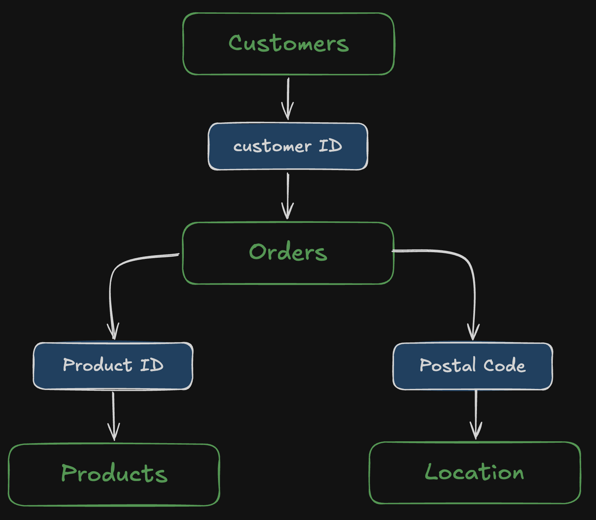

# Sales-and-Profit-BI

An interactive Tableau dashboard designed to analyze sales performance, profitability, customer behavior, product performance, and regional trends using a multi-table business dataset.

## 📊 Project Overview

This project focuses on transforming raw business data into an interactive and decision-ready Tableau dashboard.

The dataset consists of four interconnected tables:

- **Orders** — transaction-level sales, profit, quantity, discount, and order information
- **Customers** — customer details and segmentation
- **Products** — product, category, and sub-category information
- **Location** — geographic information such as city, state, region, and postal code

The tables were joined using common identifiers to create a unified dataset for analysis.

## 🎯 Objectives

- Analyze overall sales and profitability
- Identify high-performing and loss-making products
- Understand regional sales and profit distribution
- Analyze customer and segment performance
- Examine the relationship between discounts and profitability
- Build an interactive dashboard for business-oriented decision making

## 🛠️ Tools & Technologies

- **Tableau** — Data visualization & dashboard development
- **CSV** — Source datasets
- **Calculated Fields** — Profit Margin, Average Order Value, Total Orders, Total Customers, Profit per Order
- **Tableau Filters & Actions** — Interactive analysis
- **Joins** — Multi-table data integration

## 📁 Directory Structure
```text
sales-profit-intelligence-tableau/
│
├── data/
│   ├── Customers.csv
│   ├── Location.csv
│   ├── Orders.csv
│   └── Products.csv
│
├── snapshots/
│   ├── dashboard.png
|   └── data-model.png
│
└── README.md
```

## ⚡️ Data Model
The datasets were connected using the following keys:



## 🔍 Insights
The dashboard helps identify patterns such as:

- Certain sub-categories generate significantly higher profits than others.
- Some products generate substantial sales but comparatively weak profitability.
- Loss-making sub-categories can be identified through profitability analysis.
- Geographic performance varies across regions and states.
- Discounting alone does not strongly explain profitability at the sub-category level in the current analysis.

> **Note**: The dashboard is intended for exploratory and descriptive analysis. Observed relationships should not be interpreted as causal without further statistical analysis.

---
## Dashboard

#### [🚀 Dashboard](tinyurl.com/mbnad8d3)


